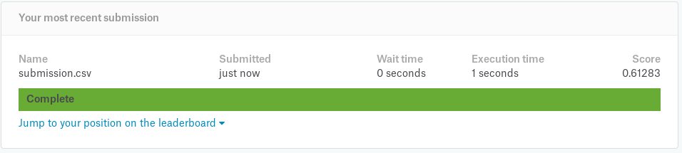

# Rotten Tomatoes Sentiment Analysis

Rotten Tomatoes Sentiment analysis using word embeddings RNN in Tensorflow. 

Nautural Language Processing (NLP) is not only extensively researched topic but also largely used in production environments for transcription, speech recognition (and synthesis), translation etc. The goal of this project is to explore progress and used methods in this field and apply some of them for Sentiment analysis. Dataset is choosed from [Kaggle competitions posted in 2015](https://www.kaggle.com/c/sentiment-analysis-on-movie-reviews).

This is not repostiry for beginers of Neural Networks, Python and frameworks such as Pandas, Numpy, Tensorflow, Keras etc. but rather for people who have no or very little experience in NLP practices. Intuition and understanding of what it is, why we need it and what is happening in area is recommended though.

## Install dependecies

TODO

## Project Structure

```
data/
    submission_*.csv # Different submission for evaluation
    load_dataset.py # Load training and testing dataset
    test.tsv # Test dataset
    train.tsv # Train dataset
Explore.ipynb # Explore datasets
KerasLSTM.ipynb # Experiments and submission creation
*GoogleNews-vectors-negative300.bin* # Google word2vec model should be stored here
```

## Current state

Results of-course are not yet satisfying. Better than all classified as Neutral (51.x) so 10% up from that.

Currently first experiments done in [KerasLSTM.ipynb](KerasLSTM.ipynb) and these results achieved.

__I suspect much more work at data preprocessing which I wasnt spending much time on but decided to go straight to classification itself. Better understanding of data is crucial to undestand why results are so bad.__



## Simple dataset exploration with [Pandas](http://pandas.pydata.org/)

See [Explore.ipynb](Explore.ipynb) for data visualization and insights.

As per word frequncy, unique words and most common words we can see that both datasets are similarly divided except Train set have much more unique words than Test set which is ok.

It's worth noting that some words (2914) which can be found in Test Set cannot be found in Train set. e.g. 'Boxing', 'professionalism', 'applaud'. This is obvius flaw in our training set however their occurances are not very fequent max 45 for 'boxing', also Tokenizer (Word embeddings) will help us to deal with this problem by understanding what words are nearby.

Train set however have 9374 words which can't be found in Test set with tops of 144 occurances for word 'colclusion'.

## Training simple LSTMs with words embeddings with Keras

Before that if you don't know what are word embeddings read [this section](#word-embeddings).


## Word Embeddings

### Why we need them ?

Most intuitive way of classifying phrases based on labels would be classify each phrase as input vector of words where each letter represents some numerical value fro 0 to 35. That would actually work but very fast we would see that this approach is limited in terms of accuracy and it is because we does not context of what each word represents. For example if neural network sees 'apple' it does not know if it is Company or Fruit, why not calculate that before traning neural netowork and then use this prior knowledge ? Besides that is doesn't even know what 'apple' is word but rather vector of numbers.

### What are they ?

It is creatation of a representation for words that capture their meanings, semantic relationships and the different types of contexts they are used in. Numerical representations of text so that we can mathematically process them for e.g. Neural Networks.

### Example

Take a look at this example – sentence=” Word Embeddings are Word converted into numbers ”

A word in this sentence may be “Embeddings” or “numbers ” etc.

A dictionary may be the list of all unique words in the sentence. So, a dictionary may look like – [‘Word’,’Embeddings’,’are’,’Converted’,’into’,’numbers’]

A vector representation of a word may be a one-hot encoded vector where 1 stands for the position where the word exists and 0 everywhere else. The vector representation of “numbers” in this format according to the above dictionary is [0,0,0,0,0,1] and of converted is[0,0,0,1,0,0].

There are different types of embeddings such as:

* Frequency based Embedding
* Prediction based Embedding

### Embeddings in this project

For this project we are using simple word mapping to numerical values in Keras using [Tokenizer](http://www.orbifold.net/default/2017/01/10/embedding-and-tokenizer-in-keras/) class and then word2vec. In the end we do the same in Tensorflow using Google pre trained Word2Vec embeddings. Download it [here](https://drive.google.com/file/d/0B7XkCwpI5KDYNlNUTTlSS21pQmM/edit).

For more info go [here](https://www.analyticsvidhya.com/blog/2017/06/word-embeddings-count-word2veec/).


## References

 * [Kaggle competition home page for Sentiment Analysis challenge](https://www.kaggle.com/c/sentiment-analysis-on-movie-reviews/data)
 * [Intuitive Understanding of Word embeddings: From Count to Vectors to Word2Vec](https://www.analyticsvidhya.com/blog/2017/06/word-embeddings-count-word2veec/)
 * [LSTM Sentiment analysis in Keras. Example.](https://www.kaggle.com/ngyptr/lstm-sentiment-analysis-keras)
 * [List of pre-trained word embeddings](http://ahogrammer.com/2017/01/20/the-list-of-pretrained-word-embeddings/)
 * [Keras Tokenizer](http://www.orbifold.net/default/2017/01/10/embedding-and-tokenizer-in-keras/)
 * [Sentiment analysis using Google Word2Vec](https://github.com/mnebuerquo/tomato)
 * [Vector Representations of Words](https://www.tensorflow.org/tutorials/word2vec)
 * [Sentiment analysis on Twitter using word2vec and keras](http://ahmedbesbes.com/sentiment-analysis-on-twitter-using-word2vec-and-keras.html)